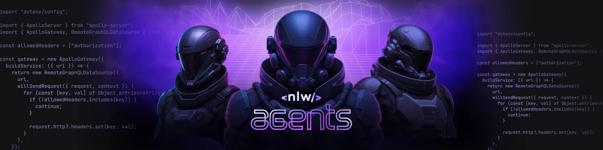
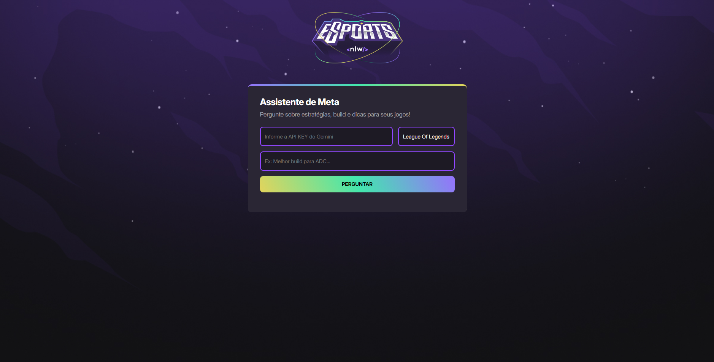
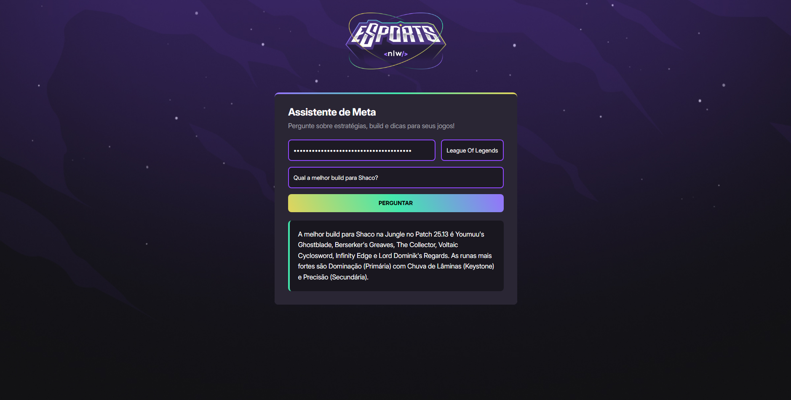

<!-- README.md -->

 

  

  
  
  
  
  
  

<h2>✨ Sobre</h2>

Nesta edição do NLW, desenvolvemos uma versão totalmente repaginada do clássico NLW eSports — agora com um toque de inteligência artificial.

A ideia foi criar um Assistente de IA para Gamers, com um visual moderno, animações suaves e, o melhor: dicas e estratégias em tempo real durante as partidas. Tudo isso alimentado pela API do Gemini, que é o cérebro por trás do nosso assistente.

Partiu levar o gameplay para outro nível? 🎮

 

  

<h2>
📚 Aprendizado </h2>

<ul>
  <li>HTML
  <li>CSS</li>
  <li>JavaScript</li>
  <li>Gemini Ai
  <li>Conceitos fundamentais da internet como HTTP, URL, IP e DNS</li>
  <li>Git e Github
</ul>

<h2>📸 Captura de Tela</h2> 

  
    

<h2>📬 Contato</h2>

Email: guilherme.tavares.cavalcante@gmail.com

  LinkedIn: <a href="https://www.linkedin.com/in/guilhermeatc/">Guilherme Augusto</a>

Obrigado por visualizar! 😁
